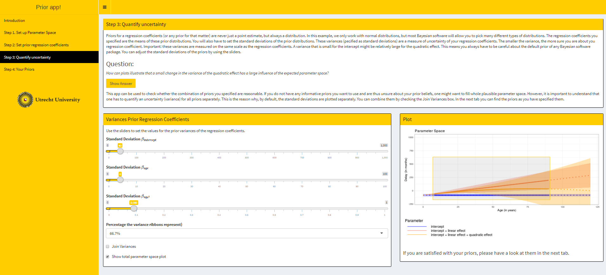

# Plausible Parameter Space (PPS) Shiny App

The Plausible Parameter Space (PPS) Shiny App is designed to help users define their priors in a linear regression with two regression coefficients. Using the same example as in the software tutorials on the [website](https://www.rensvandeschoot.com/tutorials/), users are asked to specify their plausible parameter space and their expected prior means and uncertainty around these means. The PhD-delay example has been used an easy-to-go introduction to Bayesian inference. In this example the linear and quadratic effect of age on PhD-delay are estimated. Users learn about the interaction between a linear and a quadratic effect in the same model, about how to think about plausible parameter spaces, and about specification of normally distributed priors for regression coefficients.

### How to launch the Shiny App
Go to this link: https://www.rensvandeschoot.com/tutorials/pps-app/ or https://utrecht-university.shinyapps.io/priors_phd/

### Usage
This repository contains files that are necessary to make Shiny App work. Please locate the www folder with ui.R and server.R.

### Contact
[Laurent Smeets](https://laurentsmeets.com/) and [Rens van de Schoot](https://www.rensvandeschoot.com/)

### How to cite this Shiny App in APA style 

Smeets, L., & Van de Schoot, R. (2020, September 30). Code for the ShinyApp to Determine the Plausible Parameter Space for the PhD-delay Data (Version v1.1). Zenodo. https://doi.org/10.5281/zenodo.4059418